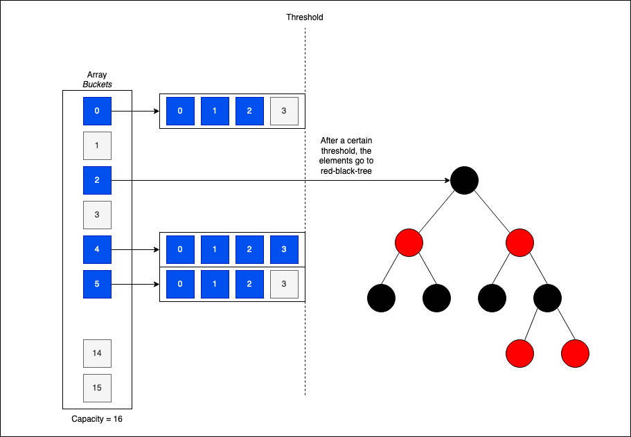
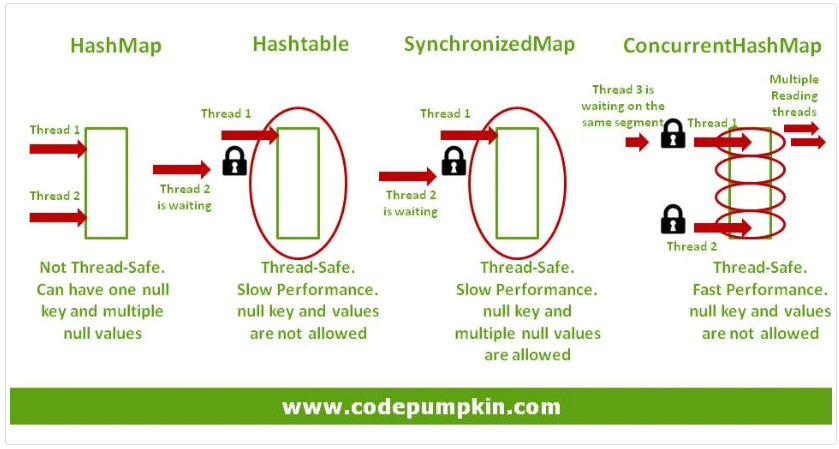

# 8장. 컬렉션 API 개선

자바 8, 9에서 추가된 새로운 컬렉션 API의 기능에 대해서 배운다.  

- 컬렉션 팩토리
- 리스트와 집합에서 요소 삭제, 교체
- 맵과 관련된 편리 기능

## 8.1. 컬렉션 팩토리

- 컬렉션 팩토리를 사용해 보다 더 간결하게 컬렉션을 만든다

```java
// 컬렉션 팩토리 사용 안함
List<String> friends = new ArrayList<>();
friends.add("Raphael");
friends.add("Olivia");
friends.add("Thibaut");

// 컬렉션 팩토리 사용
List<String> friends = Arrays.asList("Raphael", "Olivia", "Thibaut");
```

- 고정 크기의 리스트를 만들었기 때문에 요소를 추가하면 **UnsupportedOperationException** 예외 발생

### 8.1.1 리스트 팩토리

- **List.of** 팩토리 메소드

```java
// 팩토리 메소드로 생성 및 초기화
List<String> friends = List.of("Raphael", "Olivia", "Thibaut");

// 변경 시도, UnsupportedOperationException 발생
friends.add("Chih-chun");
```

- 변경이 불가능한 리스트가 생성되므로 **add**, **set** 사용이 불가능
- null 요소를 금지하므로 의도치 않은 버그를 방지할 수 있음

#### 오버로딩 vs 가변인수

10개 이상의 요소를 가진 리스트를 List.of로 생성하면 추가 배열을 할당하도록 동작한다.  
따라서, 가비지 컬렉션을 하는 비용을 지불해야 한다

### 8.1.2 집합 팩토리

- **List.of**와 비슷한 방법으로 집합도 생성 가능
- 중복된 요소를 제공해 집합을 만들면 **IllegalArgumentException** 발생

```java
// 정상 동작
Set<String> friends = Set.of("Raphael", "Olivia", "Thibaut");

// "Olivia" 중복, IllegalArgumentException 발생
Set<String> friends = Set.of("Raphael", "Olivia", "Olivia");
```

### 8.1.3 맵 팩토리

두 가지 방법으로 맵을 초기화할 수 있다

- **Map.of**
  - 키와 값을 번갈아서 메소드에 제공
  - 열 개 이하의 키와 값 쌍을 가진 맵을 만들 때 유용

```java
Map<String, Integer> ageOfFriends =
        Map.of("Rahael", 30, "Olivia", 25, "Thibaut", 26);
```

- **Map.ofEntries**
  - 객체 할당하여 맵에 키와 값 쌍 제공

```java
Map<String, Integer> ageOfFriends =
        Map.ofEntries(
            entry("Rahael", 30),
            entry("Olivia", 25),
            entry("Thibaut", 26));
```

#### 퀴즈

다음 코드를 실행한 결과는?

```java
List<String> actors = List.of("Keanu", "Jessica");
actors.set(0, "Brad");
```

## 8.2. 리스트와 집합 처리

### removeIf
  - **Predicate**를 만족하는 요소 제거
  - List, Set 모두 사용

```java
for(Transaction transaction : transactions) {
    if(Character.isDigit(transaction.getReferenceCode().charAt(0))) {
        transactions.remove(transaction);
    }
}
```

  - 위 코드는 **ConCurrentModificationException**을 발생 시킨다

```java
for(Iterator<Transaction> iterator = transactions.iterator(); iterator.hasNext();) {
    Transaction transaction = iterator.next();
    if(Character.isDigit(transaction.getReferenceCode().charAt(0))) {
        iterator.remove();
    }
}
```

- 예외가 발생하지 않도록 수정했지만 코드가 복잡하다

```java
transactions.removeIf(transaction -> 
    Character.isDigit(transaction.getReferenceCode().charAt(0)));
```

- **removeIf** 사용으로 간결화
    
### replaceAll
  - 모든 요소를 제공되는 **UnaryOperator** 함수를 사용해 교체
  - List만 사용

```java
referenceCodes.replaceAll(
    code -> Character.toUpperCase(code.charAt(0)) + code.substring(1));
```

  - **replaceAll**을 사용한 리스트에 있는 모든 요소의 첫 문자를 대문자로 변경

## 8.3. 맵 처리

맵을 활용한 자주 등장하는 패턴을 메서드로 지원

### 8.3.1. forEach 메서드

- 맵의 **Entry** 반복자를 이용해 맵을 반복할 수 있다 (번거로움)

```java
for(Map.Entry<String, Integer> entry : ageOfFriends.entrySet()) {
    String friend = entry.getKey();
    Integer age = entry.getValue();
    System.out.println(friend + "is" + age +" years old");
}
```

- **BiConsumer** (키와 값을 인수로 받음)를 인수로 받는 **forEach**로 간결과

```java
ageOfFriends.forEach(
    (friend, age) -> System.out.println(friend + "is" + age +" years old"));
```

### 8.3.2. 정렬 메서드

두 개의 유틸리티를 이용하면 맵의 항목을 값 또는 키를 기준으로 정렬할 수 있다.

- Entry.comparingByValue
- Entry.comparingByKey

```java
// 맵 구성
Map<String, String> favouriteMovies
    = Map.ofEntries(
        entry("Raphael", "Start Wars"),
        entry("Cristina", "Matrix"),
        entry("Olivia", "James Bond")
    );

// 맵 정렬 (이름 기준)
favouriteMovies
    .entrySet()
    .stream()
    .sorted(Entry.comparingByKey())
    .forEachOrdered(System.out::println);

// 결과
Cristina=Matrix
Olivia=James Bond
Raphael=Star Wars
```

### HashMap 성능

자바 8에서 내부 구조를 바꿔 성능을 개선함

- 버킷이 커질경우 **O(n)** 복잡도를 가지는 LinkedList를 Tree로 변경 **O(log(n))**



### 8.3.3. getOrDefault 메서드

맵에 키 존재 여부를 일일히 확인하지 않고 메서드를 사용하여 편리성 증대

```java
Map<String, String> favouriteMovies
    = Map.ofEntries(
        entry("Raphael", "Start Wars"),
        entry("Olivia", "James Bond")
    )

System.out.println(favouriteMovies.getOrDefault("Olivia", "Matrix"));   // James Bond 출력
System.out.println(favouriteMovies.getOrDefault("Thibaut", "Matrix"));   // Matrix 출력
```

- 키가 존재하더라도 값이 null 이면 getOrDefault가 null을 반환한다
- 키가 존재하는지 안하는지만 판단함

### 8.3.4. 계산 패턴

맵에 키 존재 여부에 따라 동작을 결정

- computeIfAbsent: 제공된 키에 해당하는 값이 없으면(혹은 null), 키를 이용해 새 값을 계산하고 맵에 추가
- computeIfPresend: 제공된 키가 존재하면 새 값을 계산하고 맵에 추가
- compute: 제공된 키로 새 값을 계산하고 맵에 저장

### 8.3.5. 삭제 패턴

특정 value의 엔트리를 삭제하고 싶을 때 key를 사용해 삭제하는 **remove**로 삭제를 구현할 수 있다

```java
String key = "Raphael";
String value = "Jack Reacher 2";

if (favourieMovies.containsKey(key) && Object.equals(favourieMovies.get(key), value)) {
    favourieMovies.remove(key);
    return true;
} else {
    return false;
}
```

- 다음과 같이 간결화 시킬 수 있다 

```java
favouriteMovies.remove(key, value);
```

### 8.3.6 교체  패턴

맵의 항목을 바꾸는데 사용할 수 있는 두 개의 메서드가 추가되었다

- replaceAll: **BiFunction**을 적용한 결과로 각 항목의 값을 교체
- Replace: 키가 존재하면 맵의 값을 바꿈

```java
Map<String, String> favouriteMovies = new HashMap<>();
favouriteMovies.put("Raphael", "Star Wars");
favouriteMovies.put("Olivia", "james bond");
favouriteMovies.replaceAll( (friend, movie) -> movie.toUpperCase() );
System.out.println(favouriteMovies);

// 결과
Olivia=JAMES BOND
Raphael=STAR WARS
```

### 8.3.7. 합침

두 그룹의 연락처를 포함하는 두 개의 맵을 합친다고 가정했을 때 **putAll**을 사용할 수 있다

```java
Map<String, String> family = Map.ofEntries(
    entry("Teo", "Start Wars"),
    entry("Cristina", "James Bond")
);

Map<String, String> friends = Map.ofEntries(
    entry("Raphael", "Start Wars")
);

Map<String, String> everyone = new HashMap<>(family);
everyone.putAll(friends);
```

- 중복된 키가 있을 때 **merge**를 사용하면 값을 좀 더 유연하게 합칠 수 있다

```java
Map<String, String> everyone = new HashMap<>(family);
friends.forEach(
    (k, v) -> everyone.merge(k, v,
        (movie1, movie2) -> movie1 + "&" + movie2)
    );
```

## 8.4 개선된 ConcurrentHashMap

- 동시성 친화적인 기술을 반영한 HashMap 버전 클래스
- 동기화된 **HashTable**에 비해 성능이 더 뛰어남
- 버킷 단위로 lock 적용



### 8.4.1. 리듀스와 검색

ConcurrentHashMap은 스트림에서 봤던 것과 비슷한 종류의 세가지 연산을 지원

- forEach: 각 (키,값) 쌍에 주어진 액션을 실행
- reduce: 모든 (키,값) 쌍을 제공된 리듀스 함수를 이용해 결과로 합침
- search: null이 아닌 값을 반환할 때까지 각 (키,값) 쌍에 함수를 적용

- **reduceValues** 메서드를 이용해 맵의 최댓값을 찾는다

```java
ConcurrentHashMap<String, Long> map = ConcurrentHashMap<>();
long parallelismThreshhold = 1;
Optional<Integer> maxValue =
    Optional.ofNullable(map.reduceValues(parallelismThreshhold, Long::max));
```
